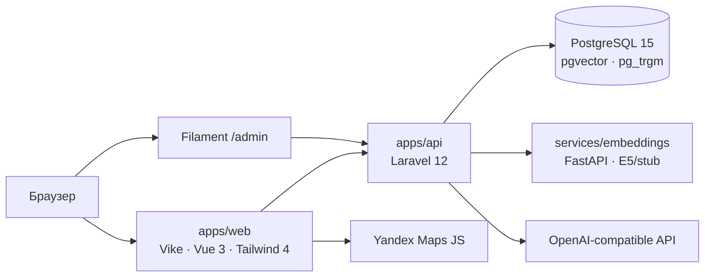

# Taco Tours

Каталог туров с публичным SSR-сайтом, админкой и семантическим поиском. Бронирования нет — только контент и навигация.

## Что умеет

Публичная часть — это SSR-каталог на Vike + Vue 3 с карточками, пагинацией и фильтрами по категории, длительности, цене и датам заезда. Поиск гибридный: pg_trgm подмешивает текстовый score, pgvector — косинусное расстояние; режим возвращается в `meta.mode` (`hybrid`, `keyword` или `semantic`).

Карточка тура содержит фотоальбом (карусель Embla), описание в Markdown, длительность, категории, маршрут на Яндекс.Карте с пешеходным построением через Router API и таблицу заездов с ценами.

Админка `/admin` на Filament 3 покрывает CRUD туров, фото и заездов, настройки LLM-провайдера (OpenAI-совместимого) и одноразовую генерацию черновика тура из текстового промпта. После сидов в БД лежит 25 туров из `database/seeders/data/tours.json` — работает без LLM-ключа.

## Архитектура



Каталог и поиск ходят в Laravel REST API, тот читает PostgreSQL и при необходимости дёргает FastAPI-сервис эмбеддингов. Векторы пересчитываются Laravel-очередью (`RecomputeTourEmbedding`) или вручную через `php artisan tours:embed-all --sync`. Карта и пешеходный маршрут собираются на клиенте из `route_geojson` тура.

## Стек

API и админка — Laravel 12 + Filament 3 + Sanctum, тесты Pest. Фронт — Vike (SSR), Vue 3, Tailwind CSS 4 с кастомной темой в `apps/web/assets/main.css` (oklch-палитра коралл/teal), Vitest + Playwright. БД — PostgreSQL 15 с расширениями pgvector (HNSW-индекс на `embedding vector(384)`) и pg_trgm. Сервис эмбеддингов — FastAPI на `intfloat/multilingual-e5-small` (или hash-stub для оффлайн-разработки). Инфраструктура — Docker Compose, корневой Makefile, GitHub Actions.

## Структура репозитория

```
apps/api/              Laravel API + Filament-админка
apps/web/              Vike SSR, публичный каталог
services/embeddings/   FastAPI-сервис векторизации
docker/                Dockerfile.api, Dockerfile.web
Makefile               команды make up/setup/api/web/embeddings
```

## Локальный запуск (Laragon / Windows)

Нужны PHP 8.3+, Composer, Node 22+, Python 3.11+ и PostgreSQL 15 с возможностью `CREATE EXTENSION vector`.

```sql
CREATE DATABASE tours;
\c tours
CREATE EXTENSION vector;
```

API:

```bash
cd apps/api
copy .env.example .env
composer install
php artisan key:generate
php artisan migrate --seed
php artisan serve --port=8000
```

Embeddings:

```bash
cd services/embeddings
python -m venv .venv
.venv\Scripts\pip install -r requirements.txt
uvicorn app.main:app --host 127.0.0.1 --port 8001
```

После сидов пересчитайте векторы (особенно при смене `USE_STUB`):

```bash
cd apps/api && php artisan tours:embed-all --sync
```

Фронт:

```bash
cd apps/web
copy .env.example .env
npm install
npm run build   # один раз на Windows, иначе dev падает на +config.ts.build
npm run dev
```

Сайт открывается на http://localhost:3000, админка — http://localhost:8000/admin, логин `admin@example.com` / `password`. Для Яндекс.Карт в Referer ключа укажите `localhost` и не открывайте сайт как `127.0.0.1` — см. [квикстарт](https://yandex.ru/maps-api/docs/js-api/common/quickstart.html#localhost).

Из корня репозитория то же самое делается через `make install && make setup`, потом `make api`, `make embeddings`, `make web` в отдельных терминалах.

## Docker

```bash
make up
make setup
cd apps/api && php artisan tours:embed-all --sync
```

Compose поднимает PostgreSQL с pgvector, FastAPI-сервис эмбеддингов (по умолчанию stub), Laravel API на :8000, воркер очереди и Vike dev-сервер на :3000 с bind mount. Для собранного фронта вместо dev-сервера есть профиль `production`:

```bash
docker compose --profile production up -d --build web-prod
```

Очередь нужна для асинхронных embedding-джобов. Если воркер не запущен — поставьте `QUEUE_CONNECTION=sync` в `apps/api/.env`. APP_KEY перед первым запросом: `cd apps/api && php artisan key:generate --show`.

## LLM и embeddings

LLM-генерация опциональна. Без ключа всё работает на демо-сидах. Чтобы включить — зайдите в `/admin` → **Настройки LLM**, укажите provider, base URL, ключ и модель (OpenAI, Ollama, LM Studio), проверьте подключение и используйте кнопку «Сгенерировать через LLM» в форме тура. Fallback-значения можно задать в `apps/api/.env` (`LLM_BASE_URL`, `LLM_API_KEY`, `LLM_MODEL`).

Embeddings по умолчанию работают в stub-режиме (`USE_STUB=true`) — hash-вектор 384 dim без сети. Для реальной семантики поставьте `USE_STUB=false` в `services/embeddings/.env` (нужен доступ к huggingface.co) и пересчитайте векторы. Эндпоинт `POST /embed` можно защитить заголовком `X-Api-Key`, прописав `EMBEDDINGS_API_KEY` в API и в сервисе.

## API

| Метод | Путь | Назначение |
|-------|------|------------|
| GET   | `/api/categories`        | Список категорий |
| GET   | `/api/tours`             | Каталог с фильтрами и пагинацией |
| GET   | `/api/tours/featured`    | Подборка для главной |
| GET   | `/api/tours/{slug}`      | Детальная страница тура |
| POST  | `/api/search`            | Поиск `{ "q": "..." }`, режим в `meta.mode` |

## Тесты

```bash
cd apps/api && ./vendor/bin/pest
cd apps/web && npm test -- --run
cd apps/web && npm run test:e2e:ci
cd services/embeddings && pytest
```

CI прогоняет Pest на PostgreSQL + pgvector, Vitest, Playwright и pytest — конфигурация в `.github/workflows/ci.yml`.

## Лицензия

MIT — тестовое задание.
