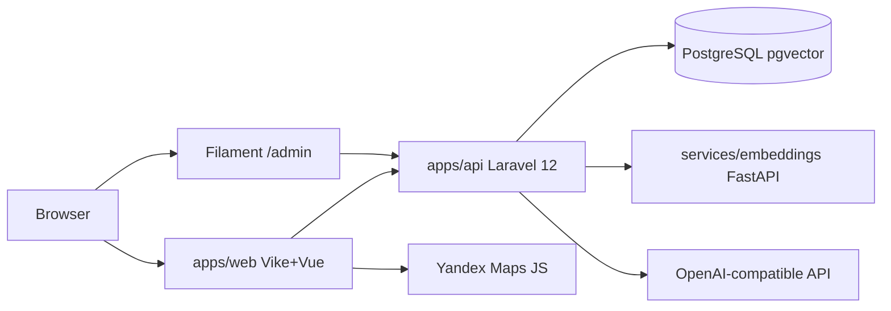

# Taco Tours

Каталог туров с фильтрами, семантическим поиском (pgvector), админкой Filament и опциональной LLM-генерацией туров. Бронирование не реализовано — только каталог и управление контентом.

## Возможности

- **Публичный каталог** — SSR на Vike + Vue 3, дизайн в духе booking.com (коралл / teal)
- **Фильтры** — категория, длительность, цена, даты заезда, сортировка
- **Семантический поиск** — PostgreSQL + pgvector, сервис эмбеддингов (E5 или stub offline)
- **Карточка тура** — фотоальбом, описание, маршрут на Яндекс.Карте, даты и цены
- **Админка** `/admin` — CRUD туров, фото, заезды, **настройки LLM**, кнопка «Сгенерировать через LLM»
- **Демо-данные** — 25 туров на русском (seed из `tours.json`)

## Архитектура



## Стек

| Слой | Технологии |
|------|------------|
| API + Admin | Laravel 12, Filament 3, Sanctum, Pest |
| Frontend | Vike, Vue 3, Tailwind CSS 4, TypeScript |
| DB | PostgreSQL 15 + pgvector |
| Embeddings | FastAPI, sentence-transformers (или stub без HuggingFace) |
| LLM | OpenAI-compatible HTTP (OpenAI / Ollama / LM Studio) |

## Структура монорепо

```
apps/api/          # Laravel API + Filament
apps/web/          # Vike SSR frontend
services/embeddings/
docker/
Makefile
```

## Быстрый старт (Laragon / Windows)

**Требования:** PHP 8.3+, Composer, Node 22+, Python 3.11+, PostgreSQL 15 с `CREATE EXTENSION vector`.

### 1. База данных

```sql
CREATE DATABASE tours;
\c tours
CREATE EXTENSION vector;
```

### 2. API

```bash
cd apps/api
copy .env.example .env   # или настройте DB_*
composer install         # mirror: mirrors.cloud.tencent.com/composer/
php artisan key:generate
php artisan migrate --seed
php artisan serve --port=8000
```

**Админка:** http://localhost:8000/admin  
**Логин:** `admin@example.com` / `password`

### 3. Embeddings

```bash
cd services/embeddings
python -m venv .venv
.venv\Scripts\pip install -r requirements.txt
# USE_STUB=true в .env — без HuggingFace (по умолчанию для offline)
uvicorn app.main:app --host 127.0.0.1 --port 8001
```

Пересчёт векторов после seed (обязательно после смены `USE_STUB` в embeddings):

```bash
cd apps/api
php artisan tours:embed-all --sync
```

**Гибридный поиск:** при совпадении по ключевым словам API объединяет текстовый score (pg_trgm на PostgreSQL, LIKE на sqlite в тестах) с векторной близостью; режим в `meta.mode`: `hybrid`, `keyword` или `semantic`.

### 4. Frontend

```bash
cd apps/web
npm install
copy .env.example .env   # Windows; template: apps/web/.env.example
npm run build   # once on Windows if dev errors on +config.ts.build
npm run dev
```

`PUBLIC_API_URL`, Yandex Maps keys — see `apps/web/.env.example`.

**Сайт:** http://localhost:3000 (для Яндекс.Карт в Referer ключа укажите `localhost`, не открывайте сайт как `127.0.0.1` — [quickstart](https://yandex.ru/maps-api/docs/js-api/common/quickstart.html#localhost))

### Makefile (корень)

```bash
make install
make setup
make api          # :8000
make embeddings   # :8001
make web          # :3000
```

## Docker

```bash
make up
make setup
# Set APP_KEY in .env at repo root (or apps/api) before first request, e.g.:
# cd apps/api && php artisan key:generate --show
```

### Compose services

| Service | Role |
|---------|------|
| `db` | PostgreSQL 15 + pgvector |
| `embeddings` | FastAPI stub (`USE_STUB=true`) with `/healthz` healthcheck |
| `api` | Laravel on :8000 (`DB_CONNECTION=pgsql`, `QUEUE_CONNECTION=database`) |
| `queue` | `php artisan queue:work` — required for async embedding jobs |
| `web` | Vike dev server with bind mount (default stack) |

**Production web image** (built assets + `vike preview`, no bind mount):

```bash
docker compose --profile production up -d --build web-prod
```

Port 3000 is still exposed; do not run `web` and `web-prod` at the same time.

### Embeddings and the queue worker

Tour embedding jobs use `QUEUE_CONNECTION=database` in compose. Either:

- run the `queue` service (`docker compose up -d queue`), or
- set `QUEUE_CONNECTION=sync` in `apps/api/.env` for local Laragon-only dev.

After seeding (Laragon or Docker):

```bash
cd apps/api
php artisan tours:embed-all --sync
```

`--sync` runs embeddings in-process (no worker). Without `--sync`, ensure `queue` is running.

### Windows: Vike dev (`ENOENT` on `+config.ts.build`)

If `npm run dev` fails looking for `+config.ts.build`, run a one-time production build first:

```bash
cd apps/web
npm run build
npm run dev
```

## LLM (два сценария)

| Сценарий | Описание |
|----------|----------|
| **Демо-контент** | 25 туров в `database/seeders/data/tours.json` — работает без API-ключа |
| **Runtime в админке** | `/admin` → **Настройки LLM** → ключ, Base URL, модель → кнопка в форме тура |

Переменные fallback в `apps/api/.env`: `LLM_BASE_URL`, `LLM_API_KEY`, `LLM_MODEL`.

## API

| Method | Path | Описание |
|--------|------|----------|
| GET | `/api/categories` | Категории |
| GET | `/api/tours` | Список + фильтры |
| GET | `/api/tours/featured` | Избранные |
| GET | `/api/tours/{slug}` | Деталь тура |
| POST | `/api/search` | Семантический поиск `{ "q": "..." }` |

## Тесты

```bash
cd apps/api && ./vendor/bin/pest
cd apps/web && npm test -- --run
cd apps/web && npm run test:e2e:ci   # Playwright smoke (build + preview)
cd services/embeddings && pytest
```

CI runs API tests against PostgreSQL + pgvector, Vitest, Playwright smoke, and embeddings pytest (see `.github/workflows/ci.yml`).

## Embeddings: stub vs E5

- **`USE_STUB=true`** (рекомендуется для локальной разработки в `services/embeddings/.env`) — hash-векторы 384 dim, без HuggingFace
- **`USE_STUB=false`** — `intfloat/multilingual-e5-small` (нужен доступ к huggingface.co)
- После переключения stub ↔ E5 пересчитайте векторы: `php artisan tours:embed-all --sync`
- Опционально: `EMBEDDINGS_API_KEY` в API и embeddings-сервисе — защита `POST /embed` (заголовок `X-Api-Key`)

## Compose / production env (см. `docker-compose.yml`)

В `apps/api/.env`: `DB_CONNECTION=pgsql`, `QUEUE_CONNECTION=database`, `EMBEDDINGS_URL=http://embeddings:8001`.  
В `services/embeddings/.env`: `USE_STUB=true` для dev без HuggingFace.

## Лицензия

MIT — тестовое задание.
