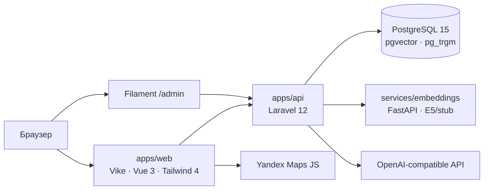

# Taco Tours

Каталог туров с публичным SSR-сайтом, админкой и семантическим поиском. Бронирования нет — только контент и навигация.

## Что умеет

Публичная часть — это SSR-каталог на Vike + Vue 3 с карточками, пагинацией и фильтрами по категории, длительности, цене и датам заезда. Поиск гибридный: pg_trgm подмешивает текстовый score, pgvector — косинусное расстояние; режим возвращается в `meta.mode` (`hybrid`, `keyword` или `semantic`).

Карточка тура содержит фотоальбом (карусель Embla), описание в Markdown, длительность, категории, маршрут на Яндекс.Карте с пешеходным построением через Router API и таблицу заездов с ценами.

Админка `/admin` на Filament 3 покрывает CRUD туров, фото и заездов, настройки LLM-провайдера (OpenAI-совместимого) и одноразовую генерацию черновика тура из текстового промпта. После сидов в БД лежит 25 туров из `database/seeders/data/tours.json` — работает без LLM-ключа.

## Архитектура



Каталог и поиск ходят в Laravel REST API, тот читает PostgreSQL и при необходимости дёргает FastAPI-сервис эмбеддингов. Векторы пересчитываются Laravel-очередью (`RecomputeTourEmbedding`) или вручную через `php artisan tours:embed-all --sync`. Карта и пешеходный маршрут собираются на клиенте из `route_geojson` тура.

## Стек

API и админка — Laravel 12 + Filament 3 + Sanctum, тесты Pest. Фронт — Vike (SSR), Vue 3, Tailwind CSS 4 с кастомной темой в `apps/web/assets/main.css` (oklch-палитра коралл/teal), Vitest + Playwright. БД — PostgreSQL 15 с расширениями pgvector (HNSW-индекс на `embedding vector(384)`) и pg_trgm. Сервис эмбеддингов — FastAPI на `intfloat/multilingual-e5-small` (или hash-stub для оффлайн-разработки). Инфраструктура — Docker Compose, корневой Makefile, GitHub Actions.

## Структура репозитория

```
apps/api/              Laravel API + Filament-админка
apps/web/              Vike SSR, публичный каталог
services/embeddings/   FastAPI-сервис векторизации
docker/                Dockerfile.api, Dockerfile.web
Makefile               команды make up/setup/api/web/embeddings
```

## Как запустить проект

Проект — три процесса плюс PostgreSQL. Без любого из них часть функций отвалится: каталог без API, поиск без embeddings, карты без ключа Яндекса.

| Сервис | Порт | Назначение |
|--------|------|------------|
| PostgreSQL 15 + pgvector | 5432 | БД туров и векторов |
| `apps/api` (Laravel) | 8000 | REST API, Filament `/admin` |
| `services/embeddings` (FastAPI) | 8001 | Семантические векторы для поиска |
| `apps/web` (Vike) | 3000 | Публичный SSR-сайт |

**После старта:** сайт — http://localhost:3000, админка — http://localhost:8000/admin (`admin@example.com` / `password`). Открывайте сайт именно как `localhost`, не `127.0.0.1` — иначе Яндекс.Карты могут не загрузиться ([квикстарт](https://yandex.ru/maps-api/docs/js-api/common/quickstart.html#localhost)).

### Требования

- PHP 8.3+, Composer
- Node.js 22+, npm
- Python 3.11+ (для embeddings)
- PostgreSQL 15 с правом `CREATE EXTENSION vector` (Laragon, Docker или отдельная установка)

### 1. База данных (один раз)

```sql
CREATE DATABASE tours;
\c tours
CREATE EXTENSION IF NOT EXISTS vector;
```

Учётные данные по умолчанию в примерах: `postgres` / `root`, БД `tours` — поправьте в `apps/api/.env`, если у вас иначе.

### 2. Первичная настройка (один раз)

Из корня репозитория:

```bash
make install
make setup
```

Или вручную:

```bash
# API
cd apps/api
copy .env.example .env          # Windows
# cp .env.example .env          # Linux / macOS
composer install
php artisan key:generate
php artisan migrate --seed

# Web
cd ../web
copy .env.example .env
npm install
npm run build                   # обязательно один раз на Windows

# Embeddings
cd ../../services/embeddings
python -m venv .venv
.venv\Scripts\pip install -r requirements.txt   # Windows
# source .venv/bin/activate && pip install -r requirements.txt   # Linux / macOS
copy .env.example .env
```

В `apps/web/.env` укажите `PUBLIC_ENV__PUBLIC_API_URL=http://127.0.0.1:8000` (или `http://localhost:8000`) и при необходимости ключи Яндекс.Карт.

**Семантический поиск:** в репозитории уже лежит локальная модель `services/embeddings/models/intfloat-multilingual-e5-small`. В `services/embeddings/.env` должно быть `USE_STUB=false` и `MODEL_ID=models/intfloat-multilingual-e5-small` (как в `.env.example`). Если папки модели нет — см. раздел [LLM и embeddings](#llm-и-embeddings).

Пересчёт векторов туров (нужен запущенный embeddings на :8001):

```bash
cd apps/api
php artisan tours:embed-all --sync
```

### 3. Ежедневный запуск — три терминала

Запускайте **все три** процесса. Порядок: сначала embeddings (модель грузится ~20–30 с), затем API, затем web.

**Терминал 1 — embeddings**

```bash
make embeddings
# или: cd services/embeddings && .venv\Scripts\python.exe -m uvicorn app.main:app --host 127.0.0.1 --port 8001 --reload
```

Дождитесь в логе строки `Embeddings model is ready` и `Uvicorn running on http://127.0.0.1:8001`. Проверка:

```bash
curl http://127.0.0.1:8001/healthz
```

Ожидается `"model_loaded":true,"use_stub":false`.

**Терминал 2 — API**

```bash
make api
# или: cd apps/api && php artisan serve --host=127.0.0.1 --port=8000
```

**Терминал 3 — фронт**

```bash
make web
# или: cd apps/web && npm run dev
```

Проверка поиска:

```bash
curl -X POST http://127.0.0.1:8000/api/search -H "Content-Type: application/json" -d "{\"q\":\"Крым море\",\"limit\":3}"
```

В ответе `meta.mode` должен быть `semantic` или `hybrid`, без HTTP 503.

### 4. Запуск через Docker

Всё в одном compose (БД, API, очередь, embeddings, web):

```bash
make up
make setup
cd apps/api && php artisan tours:embed-all --sync
```

Сервис `embeddings` монтирует `./services/embeddings/models` и стартует с `USE_STUB=false` и `HF_HUB_OFFLINE=1` — интернет для модели не нужен, если каталог `models/intfloat-multilingual-e5-small` на месте.

Полезные команды:

```bash
make logs          # логи всех контейнеров
make down          # остановить
docker compose ps  # статус
```

Собранный фронт вместо dev-сервера:

```bash
docker compose --profile production up -d --build web-prod
```

**APP_KEY:** перед первым запросом к API в Docker сгенерируйте ключ: `cd apps/api && php artisan key:generate --show` и пропишите в `.env` или в `docker compose` через переменную `APP_KEY`.

Очередь Laravel (`RecomputeTourEmbedding`) в compose уже крутится сервисом `queue`. Локально без Docker, если воркер не запущен, поставьте в `apps/api/.env` значение `QUEUE_CONNECTION=sync`.

### Частые проблемы

| Симптом | Что сделать |
|---------|-------------|
| На `/search` жёлтый баннер «семантический поиск недоступен» | Проверьте `curl http://127.0.0.1:8001/healthz` — нужно `model_loaded:true`. Перезапустите embeddings после смены кода или `.env`. |
| Embeddings долго «висит» при старте | Нормально: модель ~450 МБ грузится при старте один раз. |
| `npm run dev` падает на `+config.ts` | Выполните `cd apps/web && npm run build` один раз. |
| Поиск только `keyword`, векторы пустые | Запустите `php artisan tours:embed-all --sync` при работающем :8001. |
| Карта не грузится | Ключ в `apps/web/.env`, Referer с `localhost`, URL сайта — `http://localhost:3000`. |

## LLM и embeddings

LLM-генерация опциональна. Без ключа всё работает на демо-сидах. Чтобы включить — зайдите в `/admin` → **Настройки LLM**, укажите provider, base URL, ключ и модель (OpenAI, Ollama, LM Studio), проверьте подключение и используйте кнопку «Сгенерировать через LLM» в форме тура. Fallback-значения можно задать в `apps/api/.env` (`LLM_BASE_URL`, `LLM_API_KEY`, `LLM_MODEL`).

**Embeddings (семантический поиск):**

- Рекомендуется локальная модель в `services/embeddings/models/intfloat-multilingual-e5-small` и `USE_STUB=false` в `services/embeddings/.env` — без обращения к HuggingFace после клонирования репозитория.
- Если каталога модели нет: скачайте `intfloat/multilingual-e5-small` (нужен доступ к huggingface.co) или скопируйте из кэша HF: `make embeddings-model` (Windows, скрипт `services/embeddings/scripts/install-local-model.ps1`).
- Оффлайн-заглушка: `USE_STUB=true` — hash-векторы без семантики; поиск останется только по ключевым словам.
- После смены `USE_STUB` или модели: `php artisan tours:embed-all --sync`.
- Опционально: `EMBEDDINGS_API_KEY` в обоих `.env` (API и embeddings) — тогда `POST /embed` требует заголовок `X-Api-Key`.

## API

| Метод | Путь | Назначение |
|-------|------|------------|
| GET   | `/api/categories`        | Список категорий |
| GET   | `/api/tours`             | Каталог с фильтрами и пагинацией |
| GET   | `/api/tours/featured`    | Подборка для главной |
| GET   | `/api/tours/{slug}`      | Детальная страница тура |
| POST  | `/api/search`            | Поиск `{ "q": "..." }`, режим в `meta.mode` |

## Тесты

```bash
cd apps/api && ./vendor/bin/pest
cd apps/web && npm test -- --run
cd apps/web && npm run test:e2e:ci
cd services/embeddings && pytest
```

CI прогоняет Pest на PostgreSQL + pgvector, Vitest, Playwright и pytest — конфигурация в `.github/workflows/ci.yml`.

## Лицензия

MIT — тестовое задание.
